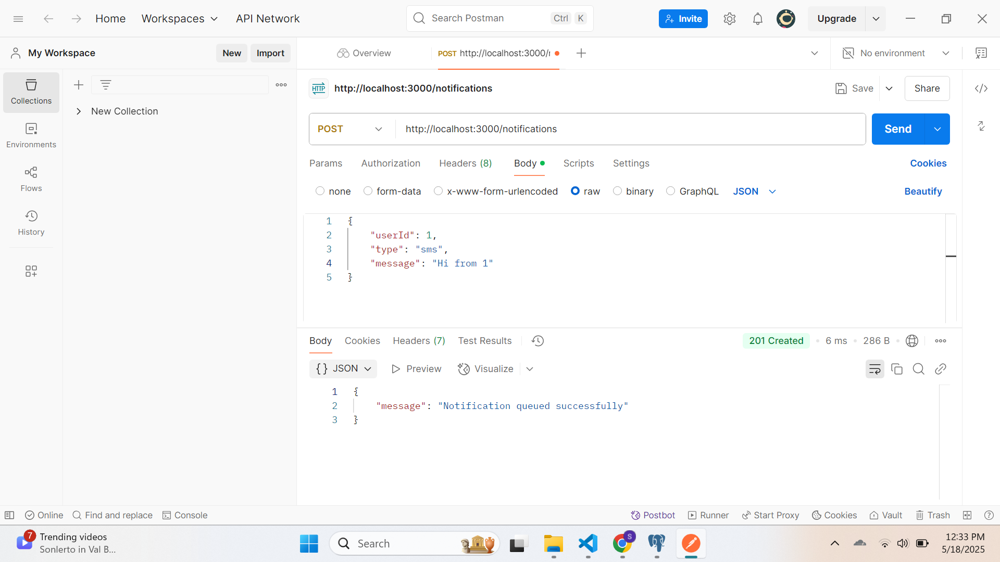
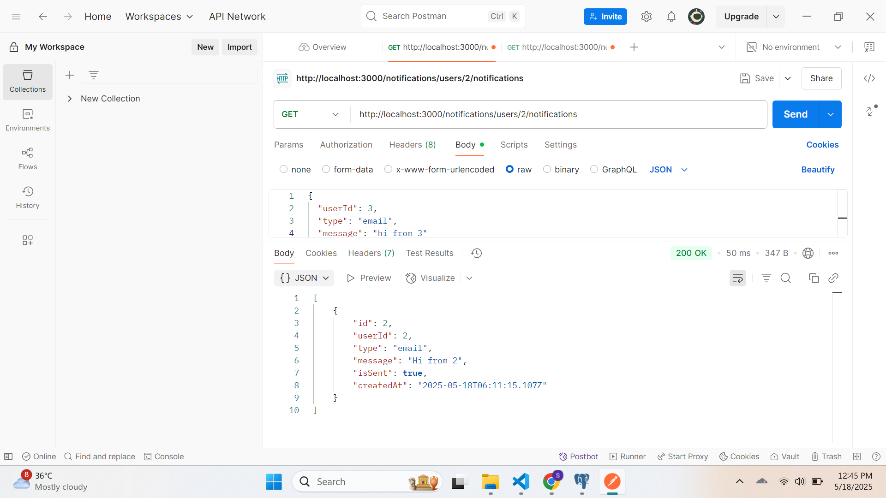
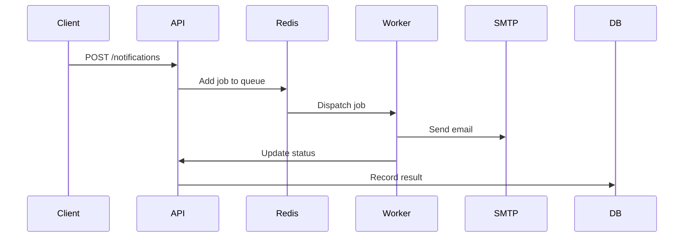
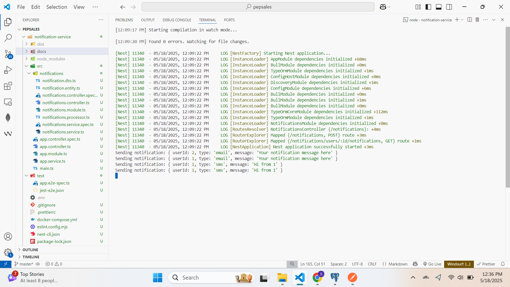

# NestJS Notification Service with Bull Queue


A production-ready notification microservice that processes emails, SMS, and in-app messages asynchronously using Redis-backed queues.

## Table of Contents
- [Features](#-features)
- [Tech Stack](#-tech-stack)
- [Prerequisites](#-prerequisites)
- [Installation](#-installation)
- [Configuration](#-configuration)
- [API Reference](#-api-reference)
- [Queue Processing](#-queue-processing)
- [Development](#-development)
- [Deployment](#-deployment)
- [Monitoring](#-monitoring)


## 🌟 Features
- **Multi-channel Delivery**: Email, SMS, and in-app notifications
- **Reliable Queueing**: Bull with Redis backend
- **Automatic Retries**: 5 attempts with exponential backoff
- **Database Persistence**: PostgreSQL storage with TypeORM
- **REST API**: Simple HTTP interface

## 🛠 Tech Stack
| Component       | Technology |
|-----------------|------------|
| Framework       | NestJS     |
| Queue System    | Bull       |
| Cache/Queue     | Redis      |
| Database        | PostgreSQL |
| ORM             | TypeORM    |
| Language        | TypeScript |

## 📋 Prerequisites
- Node.js v16+
- Redis 6+
- PostgreSQL 12+
- npm 8+ or yarn 1.22+

## 🚀 Installation
1. Clone the repository:
   ```bash
   git clone https://github.com/satyam140105/22053543-pepsales-nestjs-notification-service
   cd notification-service
   ```

2. Install dependencies:
   ```bash
   npm install
   ```

3. Set up environment variables (create `.env` file):
   ```env
   # App
   PORT=3000
   NODE_ENV=development

   # Database
   DB_HOST=localhost
   DB_PORT=5432
   DB_USER=your_user
   DB_PASSWORD=your_password
   DB_NAME=notification_db

   # Redis
   REDIS_HOST=localhost
   REDIS_PORT=6379


   ```

4. Run migrations:
   ```bash
   npm run migration:run
   ```

5. Start the service:
   ```bash
   npm run start:dev
   ```

## ⚙️ Configuration
| Variable         | Default    | Description                          |
|------------------|------------|--------------------------------------|
| QUEUE_CONCURRENCY | 5         | Number of jobs processed concurrently|
| RETRY_ATTEMPTS   | 5          | Max retry attempts per job           |
| RETRY_DELAY      | 10000      | Delay between retries in ms          |
| JOB_TIMEOUT      | 30000      | Job timeout in milliseconds          |

## 📡 API Reference

### `POST /notifications`
Create a new notification.

**Request:**
```json
{
  "userId": 123,
  "type": "email",
  "message": "Welcome to our service!",
}
```
## 📸 Screenshot

### Post Request



```

### `GET /notifications/users/:userId`
Get user's notification history.

**Response (200):**
```json
{
  "data": [
    {
      "id": 1,
      "type": "email",
      "message": "Welcome to our service!",
      "status": "delivered",
      "createdAt": "2023-01-01T00:00:00Z"
    }
  ]
}
```
## 📸 Screenshots

### Get request



## 🔄 Queue Processing

## 📸 Screenshots

### Queue



**Job Lifecycle:**
1. Received → Queued → Processing → Completed/Failed
2. Failed jobs automatically retry with exponential backoff
3. Stalled jobs are automatically recovered

## 📊 Monitoring
Recommended tools:
- **Bull Board**: Queue monitoring dashboard
- **Prometheus**: Metrics collection
- **Grafana**: Visualization

Access Bull Board at `/admin/queues` when enabled.
```

